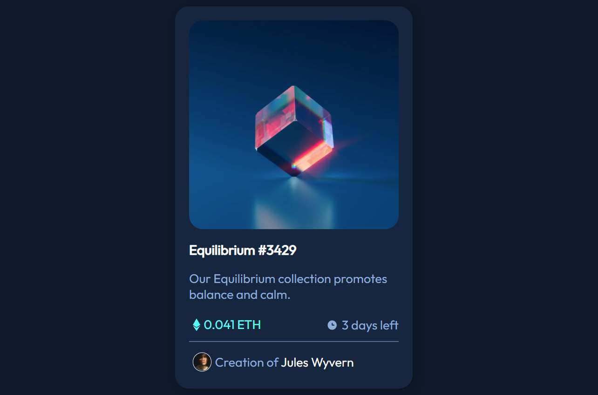

# Frontend Mentor - NFT preview card component solution

This is a solution to the [NFT preview card component challenge on Frontend Mentor](https://www.frontendmentor.io/challenges/nft-preview-card-component-SbdUL_w0U). 

## Overview

### The challenge

Users should be able to:

- View the optimal layout depending on their device's screen size
- See hover states for interactive elements

### Screenshot

### What I learned

More testing my previous skills. I used a little flexbox stuff this time. I feel like the CSS could be refactored. Seemed like a lot to get a fairly simple thing done.

### Continued development

Still hoping to learn more flexbox and CSS grid. It isn't perfect but I'm feeling fairly pleased with how these little challenges are turning out.